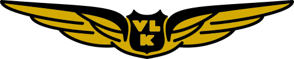

# Vallilan Lennokkikerho ry – lennokkikerho Helsingissä

Vallilan Lennokkikerho ry eli Valkka on vuonna 1937 perustettu lennokkikerho Helsingissä. Ylläpidämme Talosaaren lennokkikenttää ja kokoamme yhteen lennokkien, vapaasti lentävien, siimalennokkien, radio-ohjattavien mallien, dronejen ja helikoptereiden harrastajia.

Kerhossa on vahva tee-se-itse-perinne ja laajaa osaamista rakentamisesta, korjaamisesta, lennättämisestä ja kilpailutoiminnasta. Jäsenistöömme kuuluu sekä pitkän linjan harrastajia että uusia tulokkaita, joita autamme mielellämme alkuun.

Talosaarentien lennätyskenttä tarjoaa hyvät puitteet harrastukselle: laaja nurmialue, varikkopöytiä, tuoleja ja muita mukavuuksia. Lennättäminen jatkuu ympäri vuoden, ja kentän ylläpito tehdään kerholaisten talkootyönä.

Kentällämme on nähty vuosien varrella kaikkea klassisista liidokeista suuriin balsakoneisiin, helikoptereihin, droneihin ja erikoisiin kokeiluihin, kuten bensamoottorilla lentävä pizzalaatikko tai 400 km/h lentävä sähköpylon. Perinteet ovat meille tärkeitä, mutta uudet ideat ovat aina tervetulleita.

Kiinnostaako lennokkiharrastus? Tule tutustumaan toimintaan, kysy neuvoa tai hae jäseneksi.

[Hae jäseneksi](/jäseneksi/)  
[Tutustu aloittelijan oppaaseen](/aloittelijan-opas/)  
[Katso Talosaaren lennokkikenttä](/lennokkikenttä/)

## Mitä kerhossa harrastetaan

Valkassa lennokkiharrastus ymmärretään laajasti. Yhdelle se tarkoittaa rauhallista liitämistä termiikissä, toiselle tarkkaa siimaohjattua taitolento-ohjelmaa, kolmannelle uuden rakenteen kokeilua rakennuspöydällä.

- **Vapaasti lentävät lennokit**: liidokit, kumimoottorimallit ja muut perinteiset lajit, joissa lennokki säädetään lentämään itsenäisesti.
- **Siimaohjatut lennokit**: etenkin F2B-taitolento, jossa tarkkuus, moottorin säätö ja lentokuvion hallinta ratkaisevat.
- **Radio-ohjattavat lennokit**: trainerit, liidokit, sporttikoneet, taitolentokoneet, skaalamallit sekä sähkö- ja polttomoottorikoneet.
- **Helikopterit ja dronet**: kaluston säätöä, turvallista lennättämistä ja uuden tekniikan seuraamista.
- **Rakentelu ja korjaaminen**: balsa, solumuovi, komposiitit, 3D-tulostus, elektroniikka ja kaikki se pieni ongelmanratkaisu, joka tekee omasta koneesta oman.

Kerhoon voi tulla valmiin mallin kanssa, keskeneräisen projektin kanssa tai pelkän kiinnostuksen kanssa. Moni hyvä harrastus alkaa siitä, että tulee kentälle katsomaan ja kysymään.

## Näin pääset alkuun

1. Tutustu [aloittelijan oppaaseen](/aloittelijan-opas/).
2. Käy katsomassa [Talosaaren kenttä ja kenttäsäännöt](/lennokkikenttä/).
3. Lähetä [jäsenhakemus](/jäseneksi/), jos haluat mukaan toimintaan.

    

    <iframe width="560" height="315" src="https://www.youtube.com/embed/videoseries?list=PLN-ZCyv7vugDfvDZ-mEdemAzpmCzlJEvm" title="YouTube video player" frameborder="0" allow="accelerometer; autoplay; clipboard-write; encrypted-media; gyroscope; picture-in-picture; web-share" allowfullscreen></iframe>

    

        

            
            
        

        

        

    

