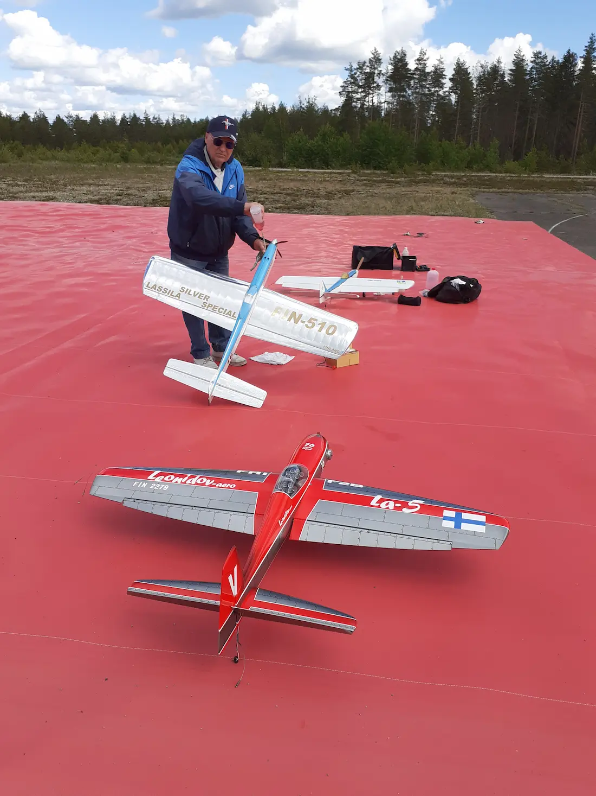
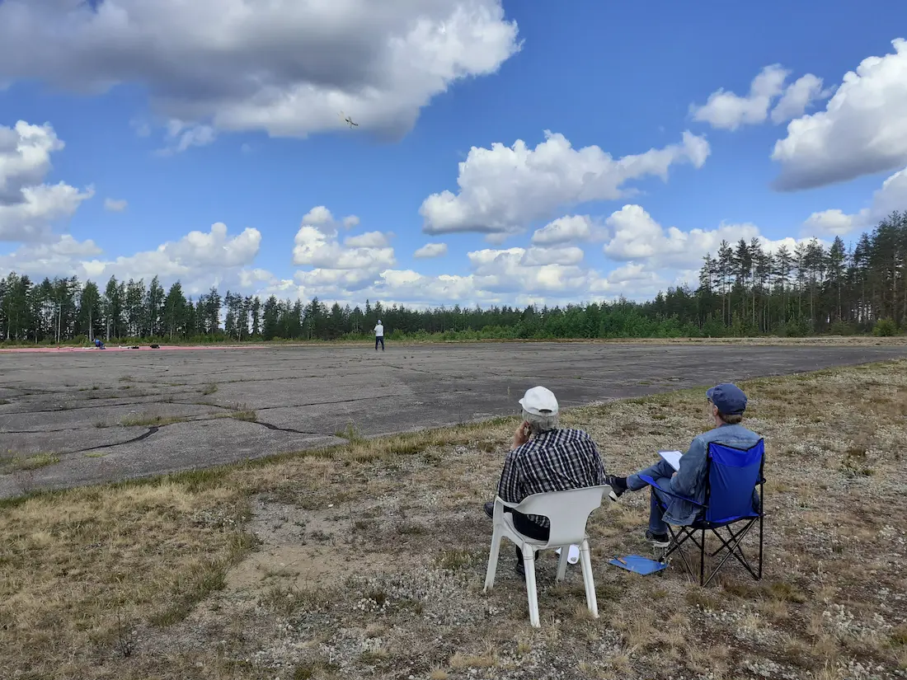
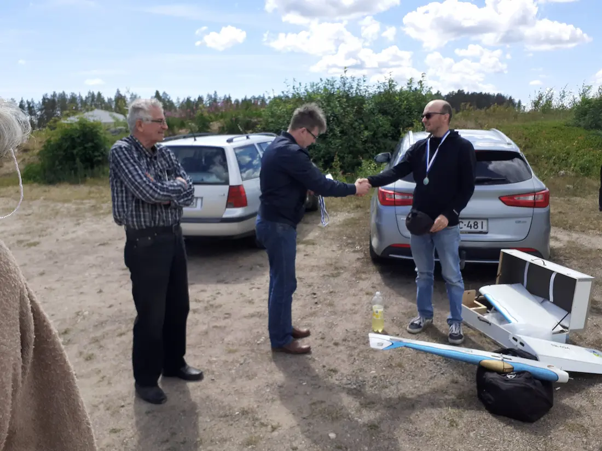
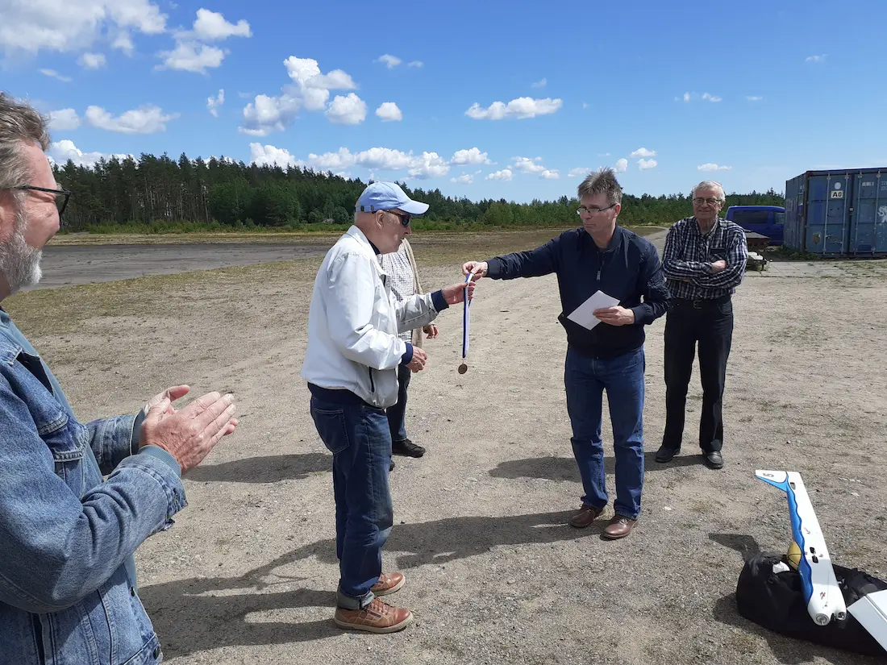

## Kilpailuraportti

### Stunttikauden 2024 avauskisat Nummelassa 15.6.2024

Siimaohjattujen taitolennokkien F2B-luokan ensimmäinen SM-osakilpailu pidettiin Nummelassa hyvien sääolosuhteiden vallitessa. Paikalle oli kuitenkin saapunut vain neljä kisaajaa, joista lisäksi järjestävän seuran Mikko Suokas joutui luovuttamaan teknisten ongelmien takia saamatta ensimmäistäkään kisasuoritusta. Ehkäpä seuraavissa, Kuopion lennokkikerho Kihun järjestämissä kisoissa pääsee jo ilmaankin. Lennokki on sentään vielä ehjä.

Kilpailut voitti Kuopion lennokkikerhoa edustava Tuomas Juutinen näyttävin suorituksin. Lassilan lennokkikerhon Elias Mayer sijoittui varmalla tyylillään toiseksi ja hallitseva Suomen mestari Kai Karma jätettiin tällä kertaa pronssille.

Tuomareina toimivat Veikko Fagerström (Munkkiniemen LK) ja Jussi Frisk (Mellunmäen LK). Tulosten laskemisen hoitivat Heikki Kangasniemi (MeLK) ja Mikko Suokas (VLK) sujuvassa kerhojenvälisessä yhteistyössä. Lisäksi on annettava kiitosmaininta Nummela RC:n puheenjohtaja Sami Ikoselle, joka tuli ystävällisesti avaamaan lennätyspaikalla olevan varastokontin, jotta saatoimme perustaa kisatoimistomme sinne. Pöytä, tuoli ja varjoisa paikka helpottavat suuresti kannettavalla tietokoneella tapahtuvaa tulostenlaskentaa, jolloin virheiden mahdollisuus pienenee ja saamme luotettavia tuloksia jo kisapaikalla. Kaikki tulokset kuitenkin tarkistetaan vielä myöhemmin järjestäjän kotitoimistossa, kuten nytkin tehtiin.

## Kilpailutulokset

| SIJA | NIMI            | Kierros 1 | Kierros 2 | Kierros 3 | Kokonaistulos | SM-%   |
|------|-----------------|-----------|-----------|-----------|---------------|--------|
| 1    | Tuomas Juutinen | 1031,50   | 1039,00   | 1028,50   | 2070,50       | 100,00 |
| 2    | Elias Mayer     | 991,00    | 989,50    | 970,00    | 1980,50       |  95,65 |
| 3    | Kai Karma       | 931,00    | 977,00    | 966,00    | 1943,00       |  93,84 |

***

<em>Elias Mayer valmistautuu kilpailulennolle. Varikkoalueelle on tänä kesänä ilmestynyt maahan ankkuroitu paperikoneen viira, joka muodosti erinomaisen alustan varikkoalueelle ja esti siimojen pölyyntymisen.</em>

<em>Kai Karma suorittaa kilpailutehtävää Veikko Fagerströmin (vasemmalla) ja Jussi Friskin kriittisen katseen alla.</em>

<em>Tuomas Juutinen on saanut kisojen ykköspalkinnon, Mikko Suokas onnittelee. Veikko "Veka" Fagerström myhäilee vieressä.</em>

<em>Mikko Suokas ojentaa Kai "Skaide" Karmalle palkinnon. Jussi Frisk (vasemmassa reunassa) ja Veikko Fagerström seuraavat vierestä.</em>

[Lisätietoa lajista ja säännöistä](/F2B-lajiesittely/)
